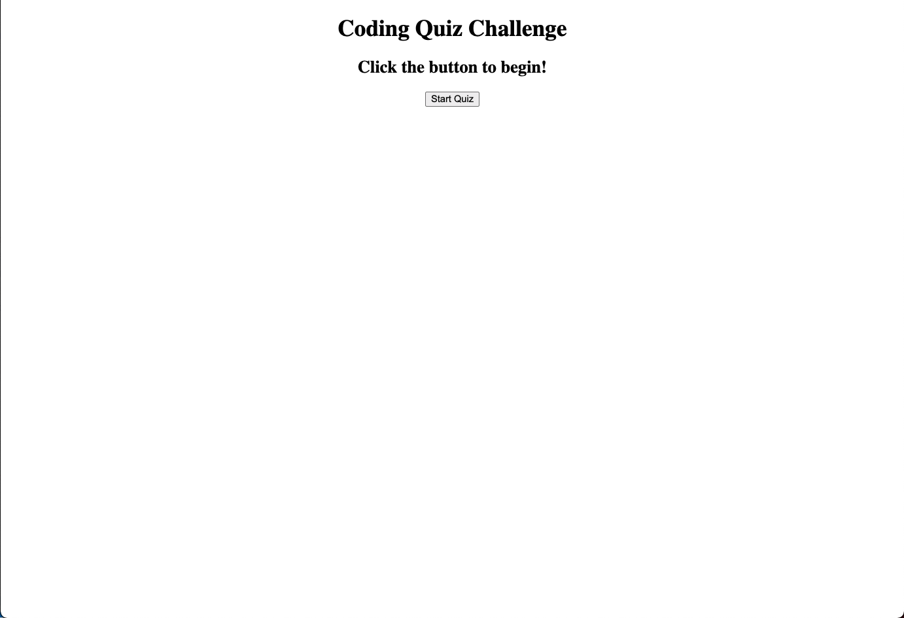

# WebAPIsCodeQuizHomework

## User Story
AS A coding boot camp student
I WANT to take a timed quiz on JavaScript fundamentals that stores high scores
SO THAT I can gauge my progress compared to my peers

# Acceptance Criteria
GIVEN I am taking a code quiz
WHEN I click the start button
THEN a timer starts and I am presented with a question
WHEN I answer a question
THEN I am presented with another question
WHEN I answer a question incorrectly
THEN time is subtracted from the clock
WHEN all questions are answered or the timer reaches 0
THEN the game is over
WHEN the game is over
THEN I can save my initials and my score

# Quiz Questions
1- "___ is a social construct and generally based on the norms, behaviors, and societal roles expected of individuals based primarily on their sex"
2- "What term refers to people whose gender identity corresponds to their biological sex?"
3- "Gender ___ is a construct that divides people into two genders: male or female."
4- "___ are the way people refer to themselves or prefer others refer to them"

## Table of Contents
[Usage](#Usage)

Licensing

Contributors

Installation

## Usage

Link to Deployed Application (https://kaiwalsh1.github.io/WebAPIsCodeQuizHomework/)
Link to GitHub Repository (https://github.com/kaiwalsh1/WebAPIsCodeQuizHomework)
